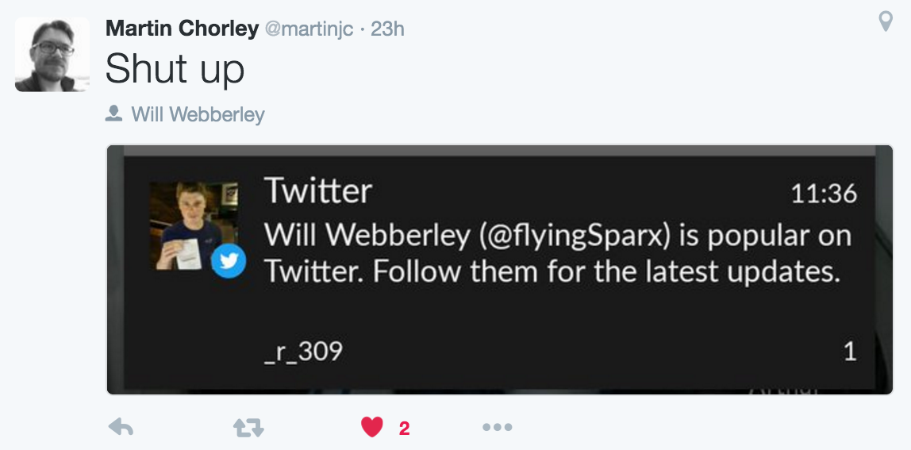
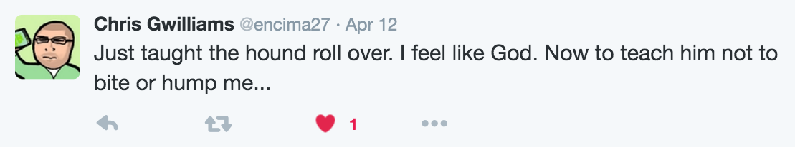
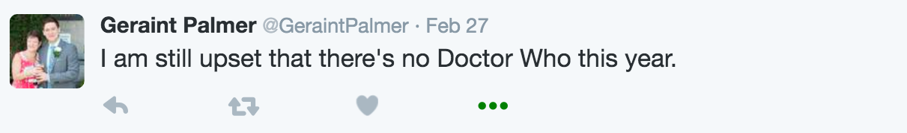

### Page ranking my twitter network
#### [@drvinceknight](https://twitter.com/drvinceknight)

---

### I like twitter

:+1:

---



---



---



---

### I follow too many people

:smirk: :weary:

---

```python
# Authenticating
auth = tweepy.OAuthHandler(consumer_key, consumer_secret)
auth.set_access_token(token, token_secret)

api = tweepy.API(auth, wait_on_rate_limit=True,
                 wait_on_rate_limit_notify=False)


def analyse_user(user_id=None):
   """Return the list of followers and last tweet date and text"""
   try:
       friends = api.friends_ids(user_id=user_id)
       try:
           last_tweet = api.user_timeline(user_id=user_id, count=1)[0]
           return friends, last_tweet.created_at
       except IndexError:  # No tweets
           return friends, False
   except tweepy.error.TweepError:  # No access to user
       return [], False
```

---

```python
network_map = {f.user_id:f.friend_ids_in_network for f in active_network_nodes}
```

---

```python
>>> G = nx.Graph(network_map)  # Graph for the whole network
>>> components = list(nx.connected_components(G))
>>> len(components)
8
```

---

```python
>>> nx.center(G)
['11348282']
>>> api.lookup_users(center)[0].screen_name
'NASA'
```

---

```python
>>> pr = nx.pagerank(G)
>>> sorted_nodes = sorted([(node, pagerank) for node, pagerank in pr.items()], key=lambda x:pr[x[0]])
```

---

```python
>>> mis = nx.maximal_independent_set(G)  # This is in fact an approximative algorithm
>>> len(mis)
300
```

---

[vknight.org/unpeudemath/code/2016/03/31/Analyzing-my-own-twitter-network-using-python.html](http://vknight.org/unpeudemath/code/2016/03/31/Analyzing-my-own-twitter-network-using-python.html)
