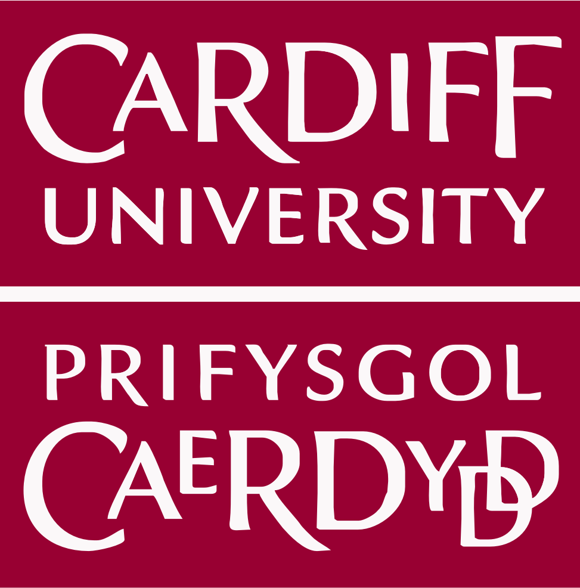
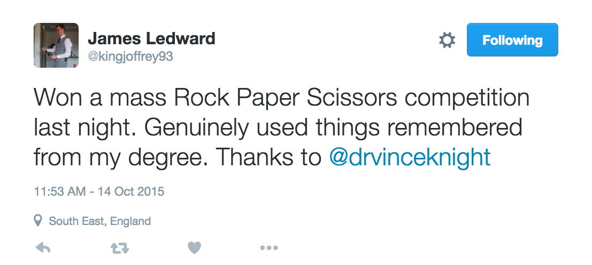
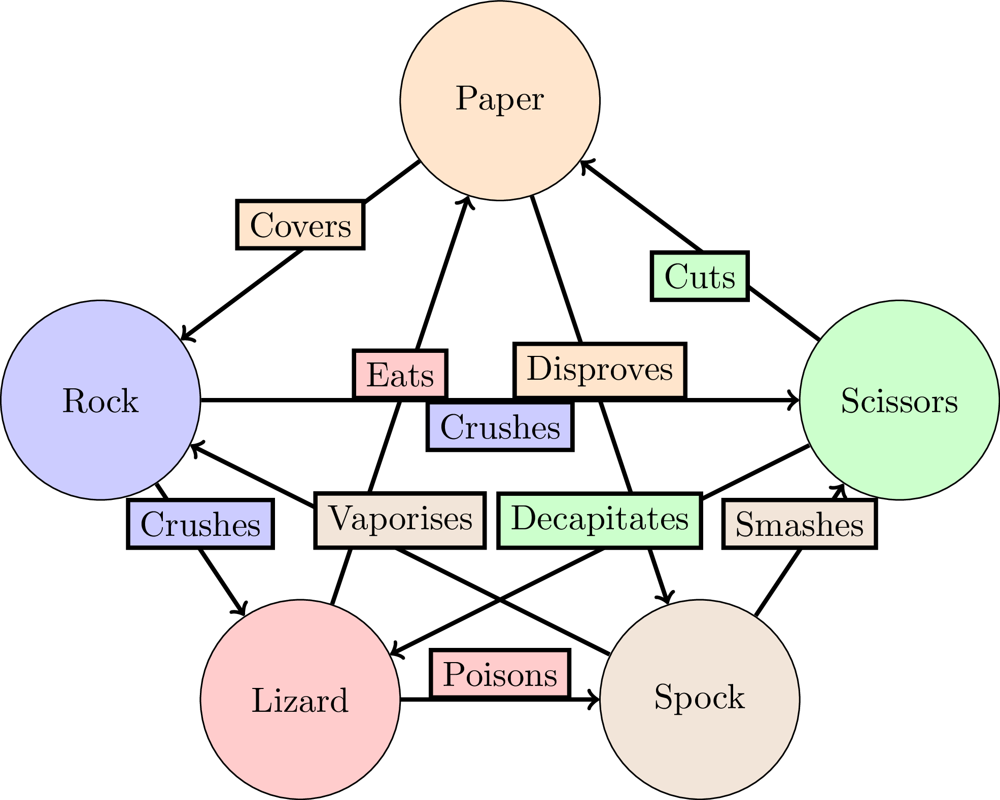

### **Welcome**!

---



^ Health and safety: no fire alarm planned today. If there is an alarm ...
^ Throughout the day: people in black shirts are helpers.

---

[\#STEMCardiff](https://twitter.com/hashtag/STEMCardiff)

^ Hashtag

---


^ Does anyone know what this is?

---


^ Sir Martin Evans (the building is named after him!)

---

**State of the art** research led **engagement**.

^ The people presenting to you today, lead there engagement through their
research. This is a great opportunity: world leaders in their field at your
fingertips.

---

- Workshops
- Forum

---

### Subjects


```
    - Architecture               - Biology
    - Chemistry                  - Computing
    - Earth Sciences             - Engineering
    - Mathematics                - Pharmacy
    - Physics
```

^ Fantastic workshops and forum activities:
- ARCH: Visit the skydome and see and architecture exhibit;
- BIO: Explore the brain and the heart;
- CHEM: 3d world: explore atoms;
- COMP: Learn to code;
- EARTH: Looking at fossils;
- ENGIN: Building structures using sweets!!!;
- MATHS: US;
- PHARM: Brain, bees and honey;
- PHYSICS: Science behind those 3D glasses

---

### Mathematics is **not** useful

---



[@kingjoffrey93](https://twitter.com/kingjoffrey93/status/654233609021296640)

---


---



---

### My advice

1. Ask questions.
2. Enjoy yourselves.
3. Ask questions.

[\#STEMCardiff](https://twitter.com/hashtag/STEMCardiff)
